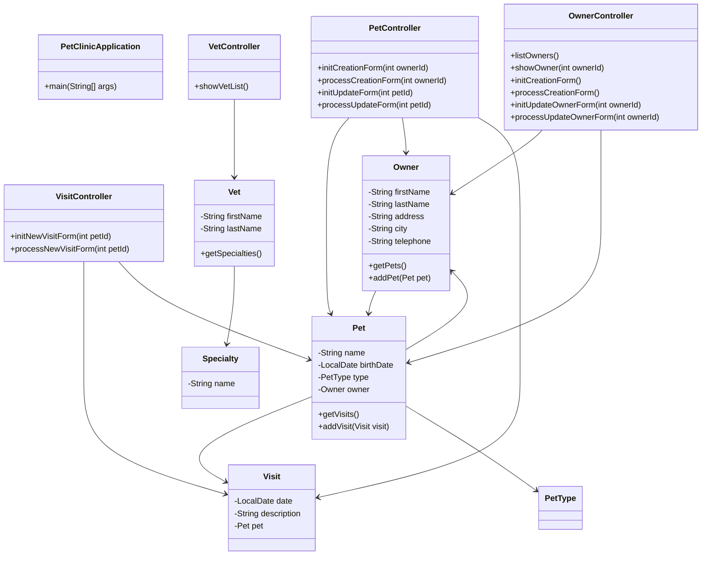

## Class Diagram

```mermaid
classDiagram
    class PetClinicApplication {
        +main(String[] args)
    }

    class OwnerController {
        +listOwners()
        +showOwner(int ownerId)
        +initCreationForm()
        +processCreationForm()
        +initUpdateOwnerForm(int ownerId)
        +processUpdateOwnerForm(int ownerId)
    }

    class PetController {
        +initCreationForm(int ownerId)
        +processCreationForm(int ownerId)
        +initUpdateForm(int petId)
        +processUpdateForm(int petId)
    }

    class VisitController {
        +initNewVisitForm(int petId)
        +processNewVisitForm(int petId)
    }

    class VetController {
        +showVetList()
    }

    class Owner {
        -String firstName
        -String lastName
        -String address
        -String city
        -String telephone
        +getPets()
        +addPet(Pet pet)
    }

    class Pet {
        -String name
        -LocalDate birthDate
        -PetType type
        -Owner owner
        +getVisits()
        +addVisit(Visit visit)
    }

    class Visit {
        -LocalDate date
        -String description
        -Pet pet
    }

    class Vet {
        -String firstName
        -String lastName
        +getSpecialties()
    }

    class Specialty {
        -String name
    }

    OwnerController --> Owner
    OwnerController --> Pet
    PetController --> Pet
    PetController --> Owner
    PetController --> Visit
    VisitController --> Visit
    VisitController --> Pet
    VetController --> Vet
    Vet --> Specialty
    Owner --> Pet
    Pet --> Visit
    Pet --> PetType
    Pet --> Owner
```